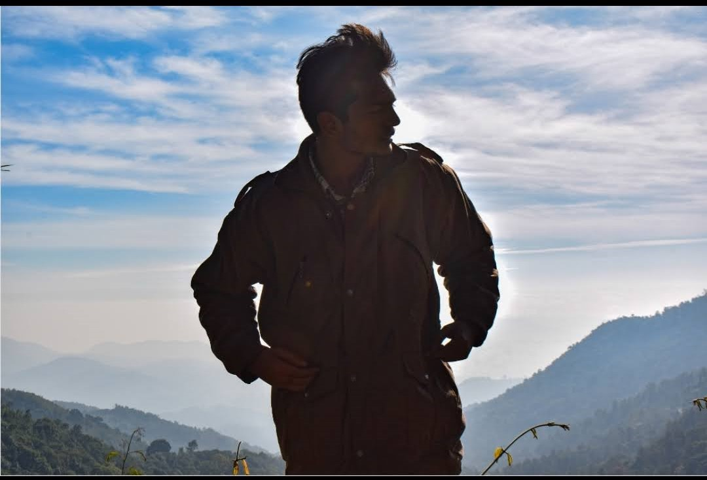
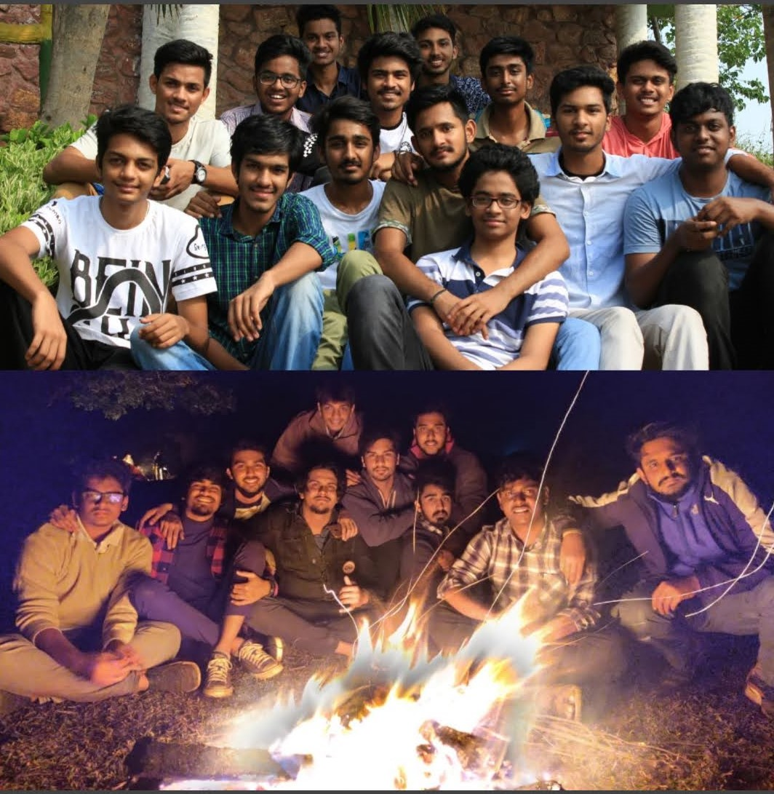

# WEBSITE UNDER CONSTRUCTION

My name is Mantha Bharadwaj (Mb), welcome to my website!. I would like to engage you as far as I can. Hope you have a good time.

Two years of hardcore pressure in every student's life in India:

Find out here: [My Quora Answer](https://qr.ae/pNcMoZ)

This is me. This picture has nothing to do with the stuff you are about to read. Just thought it carries a good vibe and goes in par with the content. Would like to share a few thoughts about 
**How I view life**.

There is no actual dictionary meaning of life, its definition changes according to perspectives of each and every human being.

So here, I would like to write how **I** see life as a whole.

I personally feel life is very short, we could not even know and imagine how the next split second of our life is going to be.
Life is very short to waste our valuable energy on unimportant things, which doesn't have any logic involved in it.

I personally believe internal happiness is the full stop of any human being. Each and every homosapien strive to be happy at the end.
And i also strongly believe life is all about making **_memories_**.
There will be a time in life where _money_, _status_, _respect in society_ doesn't make you feel alive, but thinking about memories always spreads a beautiful smile on your face.

Those specific moments where your heart blushes is the most priceless feeling ever and to be **cherished**.

So i personally feel living an absolute matured and carefree life with a sense of logic is far more better than living a stereotyped life where u blindly follow others without a touch of your own thought.

#### Cheers:)

Would like to share some thoughts on FRIENDS

Absolutely blessed to have these blokes in my life!

 I feel friends undoubtedly play a very important role in anyone's lives as a maximum part of man's attitude and character is shaped by friends.
 In our childhood suppose to say at an age of 8 or 9, parents are our entire world. We are going to start hearing all the new things from our parents first.

 We get to know the origin of most of the things from our parents.
And then comes the age where some sense of maturity is imbibed in our heads, and friends come into our life.
 They will show you how one single thing can be viewed from different perspectives by letting their opinions out.

 Till then it is a single highway which is imprinted by our parents but from then  we experience a crossroads.
 We feel excited about this new update in life and start to value our friends a lot. So as an output of this we do not actually try to imbibe things said by parents or adults.

 **At the age of teenage we _listen_ to our parents but _follow_ our friends**.

 And then on we **experience** n number of things in life with our fellow mates. We get to learn so many things in this 'experience' process.

 **Parents shape our root character and friends shape our attitude** 

 Friends just fill our pockets with all kinds of memories till the end of our life.
 I say, a person is absolutely lucky for his **lifetime** if he finds a _good_ and _matured_ friend circle of _his taste_.

  **Parents give us the introduction but friends take us till summary**.
###                  Cheers:)

